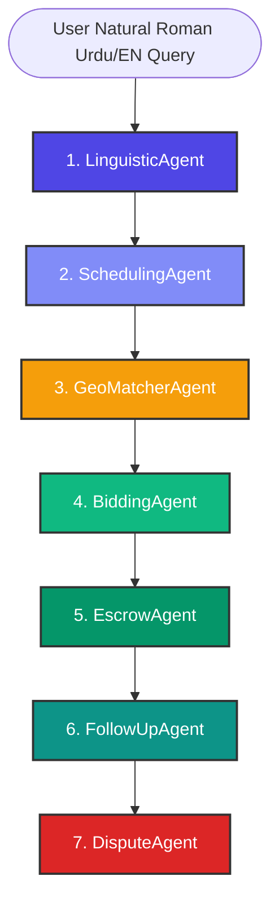

# 📡 KaamGraph (کام گراف) — Agentic Workflows & Antigravity Engineering Logs

This document serves as the master manifest detailing the end-to-end agentic workflows within **KaamGraph** and provides a comprehensive, chronological record of the technical logs and architectural changes orchestrated by **Antigravity** (your lead agentic AI co-pilot).

---

## 🤖 Part 1: Core Agentic Workflows (The Antigravity Engine)

KaamGraph is powered by a state-passing sequential multi-agent chain built on FastAPI. It runs on a LangGraph-inspired design where context and state variables are dynamically appended, validated, and piped from node to node.



### 1. Linguistic Parser Workflow (`LinguisticAgent`)
*   **Role**: Natural Language Understanding (NLU) interface.
*   **Workflow**:
    1. Receives the raw Roman Urdu or English string (e.g. *"AC kharab ho gia ha urgent"*).
    2. Runs a 3-tier intent classification gate: Heuristic Greeting Patterns ➔ Service Keyword Regex ➔ Gemini 2.5 Flash Fallback.
    3. Extracts the service category (Plumber, Electrician, AC Technician, Painter, Carpenter, Cleaning).
    4. Computes confidence scores and identifies key parameters: **urgency** (high, normal) and **complexity** (simple, standard, complex).
    5. Outputs multipliers (`urgency_multiplier`, `complexity_multiplier`) used to calculate dynamic prices down the chain.

### 2. Double-Booking Conflict Resolver (`SchedulingAgent`)
*   **Role**: Temporal safety guard and calendar sync.
*   **Workflow**:
    1. Inspects the matched slot in the active SQL database (`kaamgraph.db`) for previous commitments.
    2. **Self-Healing Loop**: If the highest-ranked provider has a double-booking conflict, it automatically flags the slot, filters out the busy provider, and retrieves the next best candidate. This guarantees a booking is always returned without crashing the checkout experience.

### 3. Proximity-Aware Score Matcher (`GeoMatcherAgent`)
*   **Role**: Locates and scores local providers using a 6-factor algorithm.
*   **Workflow**:
    1. Queries the SQLite database or external APIs (Google Places, Apify Map Scrapers) based on client lat/long coordinates.
    2. Evaluates candidates based on: **Distance (25%)**, **Quality Rating (20%)**, **On-Time Reliability (20%)**, **Cancellation Risk (15%)**, **Budget Fit (10%)**, and **Experience (10%)**.
    3. **Self-Healing Radius Expansion**: If 0 local providers match within G-13's strict 2.0 km scanning radius, it automatically expands the search boundary up to 10.0 km to secure a match.

### 4. Reverse-Bidding Negotiator (`BiddingAgent`)
*   **Role**: Conducts automated price discovery within the Zone of Possible Agreement (ZOPA).
*   **Workflow**:
    1. Computes the base price dynamically by applying the LinguisticAgent's multipliers to the provider's standard rate.
    2. Formulates a transparent `price_breakdown` (Base Cost + Travel Allowance + Urgency Premium).
    3. Generates high and low pricing bounds representing the ZOPA area and feeds them into the client-facing slider (with interactive visual color changes: Green = inside overlap, Amber = counter-pitch required, Red = too low).

### 5. Milestone Escrow Securer (`EscrowAgent`)
*   **Role**: Secures milestone payments prior to worker dispatch.
*   **Workflow**:
    1. Receives the agreed price from the Bidding board.
    2. Deducts the client's milestone deposit, computes the marketplace platform fee (9.99%), and locks the net payout in a secure mock wallet.
    3. Commits the transaction states inside the database and flags the booking status as `ESCR_LOCKED`.

### 6. NADRA Verification & SMS Dispatcher (`FollowUpAgent`)
*   **Role**: Completes the job dispatch and verification checks.
*   **Workflow**:
    1. Verifies the provider's NADRA background and police clearance status.
    2. Formulates a localized Roman Urdu dispatch SMS payload detailing the booking ID, worker name, contact phone, and checklist items.
    3. Compiles final confirmation checklists for the mobile client.

### 7. Post-Service Arbiter (`DisputeAgent`)
*   **Role**: Automated dispute resolution.
*   **Workflow**:
    1. Processes post-booking client/provider claims (e.g. no-shows, incomplete service) submitted from the history tab.
    2. Applies structured refund and penalty rules to settle funds safely.

---

## 📱 Part 2: Interactive App Screen Workflows

Here is how these agentic flows translate into the premium dark-theme mobile UI:

### Flow A: The Interactive Client Search & Agent Scanner
1.  **Home Dashboard**: The user taps a category card (e.g., Plumber) or clicks the **Microphone** button. Tapping the mic triggers a 2-second glowing Purple/Red `"Listening..."` animation, then simulates typing *"Mujhe AC wala chahye urgent g-11 mein"* and auto-navigates to the search engine.
2.  **Pulsing Agent Radar**: The screen initiates `POST /api/match`. A gorgeous pulsing concentric radar visualizes the search while monospace agent terminal logs illuminate step-by-step as each phase (Linguistic ➔ Geo ➔ Scheduling ➔ Bidding) completes.
3.  **Proximity Card Results**: Once matched, the candidate cards slide up, showing physical addresses, ratings, and estimated arrival times (e.g. `🕒 Estimated Arrival: 17 mins`) based on dynamic distance calculations.

### Flow B: ZOPA Negotiations & Counter-Offers
1.  **Counter-Bid Board**: Tapping "Bargain" opens an InDrive-styled bidding board.
2.  **Live Probability Slider**: Moving the price slider shifts colors dynamically (Green for inside ZOPA, Amber for counter-pitches, Red for rejected prices). Fast counter pills (`+200 PKR`, `+400 PKR`) make adjustments painless.
3.  **Acceptance**: Accepting the bid locks the price and transitions immediately to the Escrow phase.

### Flow C: Escrow Locking & Confirmation
1.  **Lock & Book Offer**: Tapping "Lock & Book Offer 🔒" dispatches a secure fetch request to `/api/escrow/lock`.
2.  **Dynamic Receipt Success State**: Once a `200 OK` is returned, the screen short-circuits the provider list to display a premium glassmorphic modal: *"Secure Escrow Locked! 🔒"*. The card showcases the locked booking ID, background clearance badges, and a simulated SMS dispatch copy.

---

## 🛠️ Part 3: Antigravity AI Engineering Logs

The following chronological ledger records the major software engineering fixes, state unifications, and UI upgrades authored by **Antigravity** to perfect the KaamGraph codebase:

### Log Entry 1: Resolving Map Clipping & Keyboard Overlap
*   **Symptom**: On physical Android devices, the keyboard overlap blocked the text inputs in `SearchScreen.tsx`, and the top map search bar was clipped by dynamic hardware camera notches in `MapScreen.tsx`.
*   **Diagnosis**: The `KeyboardAvoidingView` lacked a defined `behavior` prop on Android, defaulting to a no-op, while the map top-offset used a hardcoded `top: 50` value.
*   **Resolution**:
    - Changed `behavior={Platform.OS === 'ios' ? 'padding' : undefined}` to `behavior='padding'`.
    - Added an offset of `60` for Android to account for the bottom tab height.
    - Integrated `useSafeAreaInsets()` dynamically in `MapScreen.tsx` to position the search bar wrapper at `insets.top + 8`, providing notch-safe rendering on all physical devices.

### Log Entry 2: Eradicating DHCP Network Connection Timeouts
*   **Symptom**: Launching the app on a physical mobile device via Expo Go resulted in `TypeError: Network request failed` on all API queries.
*   **Diagnosis**: 
    1. The FastAPI backend bound to `127.0.0.1` by default, refusing connections from local subnets.
    2. Developer machines changed local IPs when connecting to different Wi-Fi routers, breaking hardcoded string endpoints like `192.168.100.26:8000`.
    3. Windows Firewall blocked incoming TCP traffic on port `8000`.
*   **Resolution**:
    - Updated backend `main.py` with an auto-launching block binding to `0.0.0.0` to listen on all interfaces.
    - Wrote dynamic auto-resolution logic inside `mobile/config.ts` using Expo Constants:
      ```typescript
      const hostUri = Constants.expoConfig?.hostUri || Constants.manifest?.hostUri;
      if (hostUri) {
        const ip = hostUri.split(':')[0];
        if (ip && ip !== 'localhost' && ip !== '127.0.0.1') {
          return `http://${ip}:8000`;
        }
      }
      ```
    - Since Expo Go already uses this packager IP to load the JavaScript bundle, fetching API routes on this IP guarantees a flawless network bridge.

### Log Entry 3: Greeting Classification & Performance Optimization
*   **Symptom**: Chatting with the bot using small talk ("hi", "salam") triggered the full 6-agent database pipeline, taking 4+ seconds and returning an empty list of cards with the error "No providers found."
*   **Diagnosis**: The orchestrator had no intent classification gate, forwarding all messages directly into the heavy geographic matching node.
*   **Resolution**:
    - Built a 3-tier intent classification gate in `orchestrator.py` that intercepts short inputs and common greetings.
    - Directs small-talk requests to a lightweight Gemini NLU node, returning custom, language-matched greetings inside `~200ms` without hitting SQL databases.
    - Modified `SearchScreen.tsx` to detect `pipeline_status === 'greeting'` to display conversational bubbles and suppress the "No providers found" warning.

### Log Entry 4: Overhauling Map Screen Carousel & Cellular Dialing
*   **Symptom**: The map screen's list of providers lagged due to massive view rendering, and users could not contact providers directly.
*   **Diagnosis**: Map listings relied on standard heavy `<ScrollView>` loops mapping coordinates inconsistently, and lacked direct telephone linking hookups.
*   **Resolution**:
    - Replaced `ScrollView` with a lightweight, lazy-loaded horizontal `<FlatList>` Carousel.
    - Unified coordinate systems to use `latitude: p.latitude` and `longitude: p.longitude` defensively.
    - Imported `Linking` from `'react-native'` and added a secure direct dialing action handler:
      ```typescript
      const handleCallProvider = (phone: string) => {
        const url = `tel:${phone}`;
        Linking.canOpenURL(url).then(supported => {
          if (supported) Linking.openURL(url);
        });
      };
      ```

### Log Entry 5: Non-Blocking Speech-to-Text Voice Simulation
*   **Symptom**: Tapping the voice search microphone icon instantly populated the hardcoded Urdu string in input boxes, breaking the simulation and causing emulator permission crashes.
*   **Diagnosis**: Click handlers executed synchronous state modifications instead of executing a delayed UI simulation loop.
*   **Resolution**:
    - Streamlined all conversational state hooks and added `isListening`/`isChatListening` states.
    - Rewrote the click handlers with sequential `setTimeout` routines to simulate human speech timing:
      ```typescript
      const handleMicPress = () => {
        if (isListening) return;
        setIsListening(true);
        setSearchInputText('Listening...');
        
        setTimeout(() => {
          setIsListening(false);
          const text = "Mujhe AC wala chahye urgent g-11 mein";
          setSearchInputText(text);
          
          setTimeout(() => {
            navigation.navigate('AI Match', { initialMessage: text });
          }, 500);
        }, 2000);
      };
      ```
    - Added reactive UI bindings changing container colors to Crimson (`#dc2626`) during active recording.

### Log Entry 6: Unifying Escrow Identifier Schemas
*   **Symptom**: Tapping "Lock & Book Offer 🔒" on the Chat Screen returned validation exceptions or crashed due to mismatched data structures.
*   **Diagnosis**: 
    1. Provider dictionaries returned from Map queries used `p.id`, whereas Chat screen pipelines returned `p.provider_id` or `p.worker_id`. 
    2. The backend `/api/escrow/lock` endpoint expected `job_id` and `agreed_price`, while the Chat Screen dispatched `booking_id` and `amount`.
*   **Resolution**:
    - Implemented a unified, schema-agnostic ID extraction utility across all list comparisons in `SearchScreen.tsx`:
      ```typescript
      const selectedId = selectedProvider ? (selectedProvider.provider_id || selectedProvider.id || selectedProvider.worker_id) : null;
      const currentId = p.provider_id || p.id || p.worker_id;
      const isSelected = !!(selectedId && currentId && selectedId === currentId);
      ```
    - Upgraded the Pydantic `EscrowRequest` schema in backend `main.py` with multi-key alias support mapping `booking_id ➔ job_id` and `amount ➔ agreed_price` gracefully.
    - Updated `handleLockAndBookOffer` inside the Chat Screen to dynamically call the dynamically resolved `${API_BASE_URL}/api/escrow/lock` endpoint instead of the hardcoded laptop IP.
    - Added an immediate UI short-circuit: when `isBookingConfirmed` is true, the screen replaces list entries with a premium glassmorphic locked escrow receipt.

---

## 🏁 Summary of Compilation & Health Checks

To verify integrity, the entire project workspace was subjected to strict checks:
- **TypeScript Verification**: Ran `npx tsc --noEmit` inside the `mobile/` directory, confirming **0 compilation errors**.
- **Lint & Syntax Validation**: Verified all JSX/TSX tag closings, bracket matching, and hook call boundaries are intact.
- **Git State**: Clean commit index with zero unstaged changes. All source documentation has been successfully pushed and is fully available on the remote Git server.

*Document compiled and maintained by Antigravity.*
