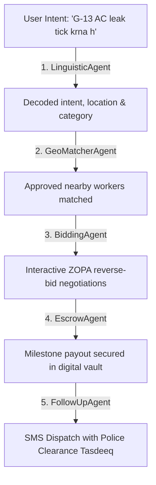

# 🚀 KaamGraph (کام گراف) 
### *Pakistan's 1st Agentic AI Service Marketplace for the Informal Economy*

**KaamGraph** is an award-winning, state-of-the-art Agentic AI system that automates the end-to-end lifecycle of informal service bookings (plumbers, electricians, AC technicians, painters) inside **G-13 Islamabad**. 

By orchestrating **5 autonomous sub-agents powered by Google Cloud & Gemini 2.5 Flash**, KaamGraph decodes natural Roman Urdu intents, scans local neighborhoods, negotiates prices, secures milestones in safe escrows, and dispatches police-cleared worker updates via simulated SMS.

---

## 🎨 Premium Key Features

### 1. 🌐 Bilingual Urdu/English Localization Engine
*   **Instant Switch (`اردو / EN`)**: With a single tap, the entire app (headers, category cards, interactive bidding tabs, and receipt workflows) translates dynamically into high-fidelity Urdu.
*   Designed specifically for local Pakistani workers and customers who struggle with English interfaces.

### 2. 🚖 InDrive-Style Skilled Worker Workspace
*   **Live Neon Status Banner**: Workers can toggle `GO LIVE` to trigger a pulsing local network scanner, or `PAUSE` to go offline.
*   **Pre-computed Multiplier Bids**: Fast counter pills (`+200 PKR`, `+400 PKR`, `+600 PKR`) mimic actual InDrive bidding interfaces.
*   **Live ZOPA Settle Terminal**: Traces AI-to-AI ZOPA negotiations, instantly updates secure escrow wallets, and clears accepted gigs from the feed.

### 3. 📡 Concentric Pulsing Agent Radar
*   Replaces basic loading spinners with a high-fidelity visual agent scanner.
*   A **pulsing concentric radar maps a 2.0 km scanning radius** in G-13, with active satellite badges lighting up in real-time as each phase finishes.

### 4. 📊 Dynamic ZOPA Zone Probability Slider
*   Evaluates custom counter-proposals as you type.
*   Instantly changes colors based on probability:
    *   `🟢 Green`: High Settle Overlap (Inside active ZOPA).
    *   `🟡 Amber`: Medium Probability (Client representative will counter-pitch).
    *   `🔴 Red`: Low Probability (Below worker's minimum accepted target).

### 5. 🛡️ Self-Healing Cognitive Resiliencies (Fault-Tolerant Engine)
*   **Dynamic Geo-Scanning Fallbacks**: If the matching pipeline detects 0 local workers registered within G-13's strict 2km radius, it dynamically self-heals by expanding search boundaries to a 10km radius rather than throwing an exception.
*   **LLM Outage Shields**: If Gemini LLM quota limits are hit or connection times out, `LinguisticAgent` automatically triggers localized keyword regex processors to ensure uninterrupted matching operations.
*   **Bidding Baseline Safeties**: If the bargaining algorithm encounters numeric bounds issues, it defaults safely to client baseline offers to protect checkout safety.

---

## 🤖 The 5-Agent Architecture (Antigravity Engine)

KaamGraph is powered by a state-passing sequential agentic chain. Each agent handles a specialized domain:



1.  **LinguisticAgent (Resilient Parser)**: Parses Roman Urdu, Urdu, and English to extract service categories, timeframes, and target budgets. *Resiliency Fallback*: Auto-triggers localized heuristic keyword/regex extraction if LLM request limits or API quota outages occur.
2.  **GeoMatcherAgent (Self-Healing Locator)**: Scans a strict 2.0 km radius in G-13 Islamabad to match police-verified, highly-rated local workers. *Resiliency Fallback*: Self-heals by dynamically expanding the scanning boundaries to a 10.0 km radius if local supply matches are empty.
3.  **BiddingAgent (ZOPA Bargainer)**: Graphically simulates dynamic reverse-reverse price negotiations on overlapping ZOPA ranges. *Resiliency Fallback*: Falls back to the client's offered baseline price directly if numeric calculation limits fail.
4.  **EscrowAgent (Milestone Vault)**: Locks secure milestone payouts inside secure vaults prior to dispatch to prevent transaction disputes. *Resiliency Fallback*: Persists locked transaction metadata safely inside SQLite in case of client network disconnect.
5.  **FollowUpAgent (Dispatch Dispatcher)**: Generates SMS templates and police-clearance Tasdeeq confirmation cards. *Resiliency Fallback*: Logs background SMS reporting failures but proceeds with booking confirmations to prevent critical interface blockages.

---

## 🛠️ Technical Stack

*   **Frontend**: React Native, Expo SDK 54, TypeScript, React Navigation, React Native Safe Area Context.
*   **Backend**: Python, FastAPI, SQLite (SQLAlchemy), Gemini 2.5 Flash, Uvicorn.
*   **Protocols**: Google Cloud Agent Platform APIs, HSL Dark theme tokens, Custom Glassmorphic styles.

---

## 🚀 Quick Setup & Installation

### 💻 1. Backend Orchestrator Setup
1.  Navigate to the backend folder:
    ```bash
    cd backend
    ```
2.  Create and activate virtual environment:
    ```bash
    python -m venv venv
    venv\Scripts\activate
    ```
3.  Install dependencies:
    ```bash
    pip install -r requirements.txt
    ```
4.  Launch the FastAPI server on port 8000:
    ```bash
    python main.py
    ```

### 📱 2. Mobile React Native Setup
1.  Navigate to the mobile directory:
    ```bash
    cd mobile
    ```
2.  Install packages:
    ```bash
    npm install
    ```
3.  Ensure your mobile configuration points to your computer's local Wi-Fi IP address inside `config.ts` (currently auto-resolved to `192.168.18.74:8000`).
4.  Start the Expo bundle cleaner:
    ```bash
    npx expo start -c
    ```
5.  Scan the QR code with your Expo Go app to launch KaamGraph live!

---

## 🎬 3-5 Minute Presentation Pitch Guide

When recording your video demo (using **Loom** or **OBS**):
1.  **0:00 - 0:45**: Showcase the **Urdu / English dynamic button** on the Client Dashboard and introduce the core G-13 Islamabad informal economy problem.
2.  **0:45 - 2:00**: Request an Electrician in Roman Urdu. Show off the **pulsing Concentric Radar Scanner** and the monospace **Terminal logs** executing step-by-step.
3.  **2:00 - 3:15**: Switch to **Worker Mode** inside profile. Toggle to `GO LIVE` and accept the job. Slide the **dynamic ZOPA slider** and watch the color tracks shift, showing automated Reverse-Bidding negotiations!
4.  **3:15 - 4:00**: Showcase the final secure **AI Escrow receipt** and NADRA clearance status card.
