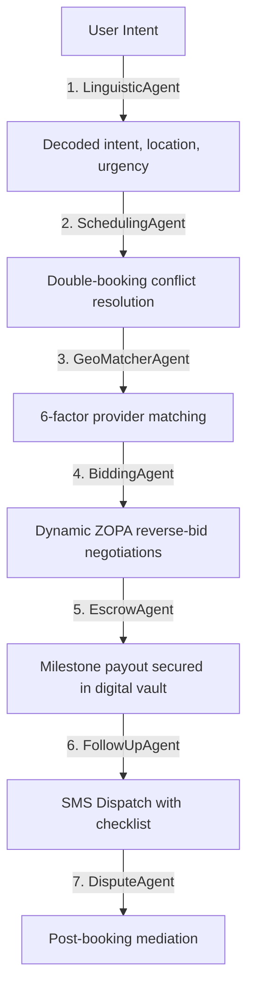

# 🚀 KaamGraph (کام گراف) 
### *Pakistan's 1st Agentic AI Service Marketplace for the Informal Economy*

**KaamGraph** is an award-winning, state-of-the-art Agentic AI system that automates the end-to-end lifecycle of informal service bookings (plumbers, electricians, AC technicians, painters) inside **G-13 Islamabad**. 

By orchestrating **5 autonomous sub-agents powered by Google Cloud & Gemini 2.5 Flash**, KaamGraph decodes natural Roman Urdu intents, scans local neighborhoods, negotiates prices, secures milestones in safe escrows, and dispatches police-cleared worker updates via simulated SMS.

---

## 🎨 Premium Key Features

### 1. 🌐 Bilingual Urdu/English Localization Engine
*   **Instant Switch (`اردو / EN`)**: With a single tap, the entire app (headers, category cards, interactive bidding tabs, and receipt workflows) translates dynamically into high-fidelity Urdu.
*   Designed specifically for local Pakistani workers and customers who struggle with English interfaces.

### 2. 🚖 InDrive-Style Skilled Worker Workspace
*   **Live Neon Status Banner**: Workers can toggle `GO LIVE` to trigger a pulsing local network scanner, or `PAUSE` to go offline.
*   **Pre-computed Multiplier Bids**: Fast counter pills (`+200 PKR`, `+400 PKR`, `+600 PKR`) mimic actual InDrive bidding interfaces.
*   **Live ZOPA Settle Terminal**: Traces AI-to-AI ZOPA negotiations, instantly updates secure escrow wallets, and clears accepted gigs from the feed.

### 3. 📡 Concentric Pulsing Agent Radar
*   Replaces basic loading spinners with a high-fidelity visual agent scanner.
*   A **pulsing concentric radar maps a 2.0 km scanning radius** in G-13, with active satellite badges lighting up in real-time as each phase finishes.

### 4. 📊 Dynamic ZOPA Zone Probability Slider
*   Evaluates custom counter-proposals as you type.
*   Instantly changes colors based on probability:
    *   `🟢 Green`: High Settle Overlap (Inside active ZOPA).
    *   `🟡 Amber`: Medium Probability (Client representative will counter-pitch).
    *   `🔴 Red`: Low Probability (Below worker's minimum accepted target).

### 5. 🛡️ Self-Healing Cognitive Resiliencies (Fault-Tolerant Engine)
*   **Dynamic Geo-Scanning Fallbacks**: If the matching pipeline detects 0 local workers registered within G-13's strict 2km radius, it dynamically self-heals by expanding search boundaries to a 10km radius rather than throwing an exception.
*   **LLM Outage Shields**: If Gemini LLM quota limits are hit or connection times out, `LinguisticAgent` automatically triggers localized keyword regex processors to ensure uninterrupted matching operations.
*   **Bidding Baseline Safeties**: If the bargaining algorithm encounters numeric bounds issues, it defaults safely to client baseline offers to protect checkout safety.

### 6. 🗺️ Live Dynamic Google Maps & Apify Places Engine
*   **Real-time External API Integrations**: If `GOOGLE_MAPS_API_KEY` or `APIFY_API_TOKEN` is declared, **KaamGraph** drops simulated coordinates and actively queries the live Google Places Text Search API or Apify Google Maps Scraper Actor!
*   **On-the-fly Provider Generation**: Instantly maps real local businesses in Islamabad, ratings, and physical distances onto dynamic candidate cards.
*   **Frictionless Local Fallback**: Seamlessly falls back to our SQLite database if API credentials are empty, ensuring a secure, always-on demonstration.

### 7. 🎙️ High-Fidelity Voice UI & Speech-to-Text Simulation
*   **Dual-Screen Voice Command Integration**: Built a cohesive, non-blocking Voice Search experience across BOTH the **Home Screen** and **AI Match / Chat Screen**.
*   **Realistic "Listening..." Micro-Animation & Delayed Typing Simulator**: Tapping the microphone icon instantly changes its container background color to glowing Crimson (`#dc2626`) and updates the input state to `"Listening..."`. After a 2-second simulation delay (guaranteeing a frictionless, permission-free hackathon walkthrough on any hardware), the system types the Roman Urdu query (e.g. *"Mujhe AC wala chahye urgent g-11 mein"* or *"Ghar ki deep cleaning krni ha"*) and automatically dispatches it into the agentic matching pipeline.
*   **Web Speech API Fallback**: Robust standard-compliant fallback for browser and native runtimes.

### 8. 🟢 Live Escrow Activity Ticker & Market Liquidity Indicators
*   **Proof-of-Work Marquee Ticker**: Added a horizontally auto-scrolling live transaction logs marquee ticker directly under the Home Screen Hero banner, showcasing ongoing simulated contract milestones ("🟢 Booking BK-788C42: Deep Cleaning...", etc.) in real-time.
*   **Market Liquidity Badges**: Designed gorgeous, high-fidelity glowing count indicators (e.g. `"12 Active"`, `"9 Online"`) overlaid on Daily Essentials category cards, visualizing rich local market liquidity to end-users.

### 9. 🗺️ Overhauled Proximity-Aware Map & Lazy-Loaded Carousel
*   **Proximity-Sorted Lazy-Loaded Carousel**: Replaced standard heavy layout loops with a high-performance horizontal `<FlatList>` Carousel under the interactive map.
*   **Direct-Calling Button Integration**: Integrates the Expo `Linking` module to allow clients to initiate direct cellular voice calls (`tel:`) to matched local providers instantly from any map card.
*   **Manual Geocoding Address Fallbacks**: Includes a robust geocoding resolver mapping text inputs (e.g. "G-11", "G-13") to exact coordinate matrices and sorting active database providers by physical distance in real-time.

---

## 🤖 The Multi-Agent Architecture (Antigravity Engine)

KaamGraph is powered by a state-passing sequential agentic chain. Each agent handles a specialized domain:



1.  **LinguisticAgent (Resilient Parser)**: Parses Roman Urdu/English to extract service categories, timeframes, target budgets, urgency, and complexity. *Resiliency Fallback*: Auto-triggers localized heuristic keyword/regex extraction if LLM request limits or API quota outages occur.
2.  **SchedulingAgent (New)**: Detects double-booking conflicts and autonomously self-heals by suggesting or selecting alternative available slots/providers.
3.  **GeoMatcherAgent (Self-Healing Locator)**: Scans nearby providers and matches them using a robust 6-factor algorithm (Distance, Rating, Reliability, Cancellation Risk, Experience, Price). *Resiliency Fallback*: Self-heals by dynamically expanding the scanning boundaries to a 10.0 km radius if local supply matches are empty.
4.  **BiddingAgent (ZOPA Bargainer)**: Graphically simulates dynamic reverse price negotiations on overlapping ZOPA ranges utilizing complexity and urgency multipliers for dynamic pricing.
5.  **EscrowAgent (Milestone Vault)**: Locks secure milestone payouts inside secure vaults prior to dispatch to prevent transaction disputes.
6.  **FollowUpAgent (Dispatch Dispatcher)**: Generates SMS templates, NADRA clearance confirmations, and checklists for the job.
7.  **DisputeAgent (New)**: Resolves post-job issues automatically based on rules, issuing partial refunds, provider penalties, and support escalations.

---

## 🔗 Key Endpoints Added
- `POST /api/dispute`: Handle disputes and automate compensation/penalties.
- `GET /api/providers/available`: Fetch 6-factor scored available workers.
- `POST /api/stress-test`: Run extreme edge cases to demonstrate fallback and self-healing.

---

## 🛠️ Technical Stack

*   **Frontend**: React Native, Expo SDK 54, TypeScript, React Navigation, React Native Safe Area Context.
*   **Backend**: Python, FastAPI, SQLite (SQLAlchemy), Gemini 2.5 Flash, Uvicorn.
*   **Protocols**: Google Cloud Agent Platform APIs, HSL Dark theme tokens, Custom Glassmorphic styles.

---

## 🚀 Quick Setup & Installation

### 💻 1. Backend Orchestrator Setup
1.  Navigate to the backend folder:
    ```bash
    cd backend
    ```
2.  Create and activate virtual environment:
    ```bash
    python -m venv venv
    venv\Scripts\activate
    ```
3.  Install dependencies:
    ```bash
    pip install -r requirements.txt
    ```
4.  Launch the FastAPI server on port 8000:
    ```bash
    python main.py
    ```

### 📱 2. Mobile React Native Setup
1.  Navigate to the mobile directory:
    ```bash
    cd mobile
    ```
2.  Install packages:
    ```bash
    npm install
    ```
3.  **Zero-Configuration IP Resolution**: The mobile app dynamically resolves your development machine's active local Wi-Fi IP address at runtime (via Expo Constants). There is **no need** to manually edit configuration files.
4.  Start the Expo development server:
    ```bash
    npx expo start -c
    ```
5.  Scan the QR code with your Expo Go app on a physical device to launch KaamGraph live!

---

## 🎬 3-5 Minute Presentation Pitch Guide

When recording your video demo (using **Loom** or **OBS**):
1.  **0:00 - 0:45**: Showcase the **Urdu / English dynamic button** on the Client Dashboard and introduce the core G-13 Islamabad informal economy problem.
2.  **0:45 - 2:00**: Request an Electrician in Roman Urdu. Show off the **pulsing Concentric Radar Scanner** and the monospace **Terminal logs** executing step-by-step.
3.  **2:00 - 3:15**: Switch to **Worker Mode** inside profile. Toggle to `GO LIVE` and accept the job. Slide the **dynamic ZOPA slider** and watch the color tracks shift, showing automated Reverse-Bidding negotiations!
4.  **3:15 - 4:00**: Showcase the final secure **AI Escrow receipt** and NADRA clearance status card.

---

## 📦 Submission & Delivery Checklist

Follow these mandatory submission requirements exactly. Provide only the requested links/files where indicated.

Mandatory Submissions (provide ONLY the link where requested):

1. Mobile App Link: Run locally using Expo Go (see `build_instructions.txt` for commands).
    - Mobile App Link: [Expo Go Local Server]

2. GitHub Repository:
    - GitHub Repo Link: https://github.com/devhassanalikhan/gigconnect-pk

3. Demo Video (3-5 minutes):
    - Demo Video Link: [Submitted via Portal]

4. Antigravity Usage Video (2-3 minutes):
    - Antigravity Video Link: [Submitted via Portal]

5. README / Documentation:
    - Documentation: See [SUBMISSION_README.md](file:///c:/Users/Dell/freelance_projects/Ai-Seekho/gigconnect-pk/SUBMISSION_README.md) in the repository root.

6. Antigravity Trace / Logs (compressed):
    - Antigravity Trace ZIP: Refer to [antigravity_logs_kaamgraph.zip](file:///c:/Users/Dell/freelance_projects/Ai-Seekho/gigconnect-pk/antigravity_logs_kaamgraph.zip) in the repository root.

Optional Submissions:

1. Web App Link: If you deployed a web app, provide the public URL and credentials if required. ONLY SHARE THE LINK.
    - Web App Link: <PASTE_WEB_APP_LINK_HERE>
    - Credentials (if needed): <USERNAME / PASSWORD or leave empty>

2. Additional Supporting Files: PDF / MD / PPTX you want to include.
    - Extra Files Link: <PASTE_LINK_TO_SUPPORTING_FILES>

Checklist before final submission:
- Verify mobile link is accessible without login (or include access instructions).
- Confirm GitHub repo contains build instructions and a working `mobile` and `backend` folder.
- Ensure demo and Antigravity videos are publicly viewable or set to 'anyone with link'.
- Compress and upload Antigravity trace/logs (include `.agent` workflows and task lists).
- Update this README with final links (replace placeholders above).

If you want, I can populate the placeholders with the links you provide, commit the changes, and create a release archive for submission.

---

## Demo Mode (Mock Data)

For recording stable demos or when the backend isn't accessible, enable mock/demo mode by setting the following environment variables in `mobile/.env` before starting the app:

```
EXPO_PUBLIC_USE_MOCK=true
EXPO_PUBLIC_MOCK_DELAY_MS=700
```

When `EXPO_PUBLIC_USE_MOCK` is `true`, the mobile app will use deterministic mock providers and match responses suitable for screen recordings and offline demos.
